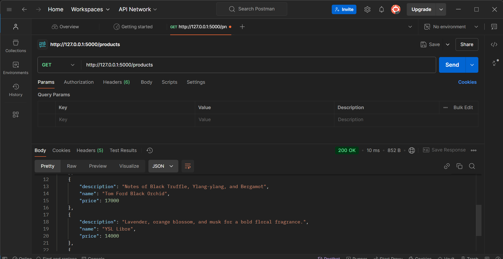

# CAT2_RESTapi - Perfume Management API  
# #168330 Monari Nicole Gesare 2.2C  

A simple project that demonstrates managing perfumes using a REST API built with Flask.

---

## Overview of the Project  

This project is designed to show how to build and interact with a REST API, featuring:  
- A **Perfume Resource** with details such as name, description, and price .  
- Endpoints for creating and retrieving perfumes.  

---

## Features  

- **Perfume Resource**:  
  - **Fields**:  
    - Name: The perfume name (e.g., Chanel No. 5).  
    - Description: Notes of the perfume (e.g., Aldehydes, Neroli, Ylang-ylang).  
    - Price  

- **Endpoints**:  
  - **POST /products**: Add a new perfume to the collection.  
  - **GET /products**: Retrieve a list of all perfumes.  

- **Client Script**:  
  - Interact with the API to add perfumes and retrieve the collection using Python's `requests` library.  

---

## How to Use  

1. **Run the API Server**:  
   - Use the provided `app.py` file to start the Flask API server.  
   - Access the server at `http://127.0.0.1:5000`.

2. **Interact with the API**:  
   - Use tools like Postman or the included `client.py` script to test the endpoints.  
   - Example actions include adding a perfume and retrieving the list of perfumes.  

3. **Python Client Script**:  
   - Run `client.py` to:  
     - Add sample perfumes to the API.  
     - Retrieve and display all stored perfumes.  

---

## Setting Up the Development Environment

### 2. Create a Virtual Environment
 To create a virtual environment, navigate to the project folder in the terminal and run:

python -m venv env

### 3. Activate the Virtual Environment
Once the virtual environment is created, activate it using the following command:

- **Windows**:
  
  .\env\Scripts\activate
  

### 4. Install Dependencies
With the virtual environment activated, install the required dependencies using `pip`:


pip install flask requests

### 5. Create a `.gitignore` File
To avoid issues when pushing code to the Git repository, create a `.gitignore` file in the project directory. Added the following line in the .gitignore file.

/env/

---


##Testing
 **Testing the GET /products Endpoint (Retrieve All Products)**:
    - In Postman, open a **new request** tab.
    - Change the request type to `GET`
    - In the **URL field**, type the endpoint for your local API:  
      `http://127.0.0.1:5000/products`
    - Click on **Send**.

## The output:




 **Testing the POST /products Endpoint (Add a New Product)**:
    - Open a new request tab in Postman.
    - Change the request type to `POST` 
    - In the **URL field**, type the endpoint for adding products:  
      `http://127.0.0.1:5000/products`
    - Click on the **Body** tab below the URL field.
    - Select **raw** and then choose **JSON** from the dropdown that appears next to it.
    - In the **Body section**, add a JSON object to represent the product. For example:
      ```json
      {
        "name": "Dior Sauvage",
        "description": "Bergamot, Ambroxan, Pepper",
        "price": 12500.00
      }
      ```
    - Click on **Send**.


